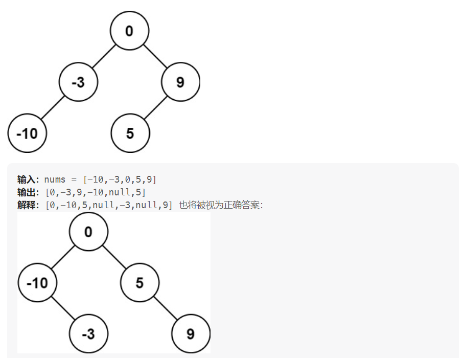
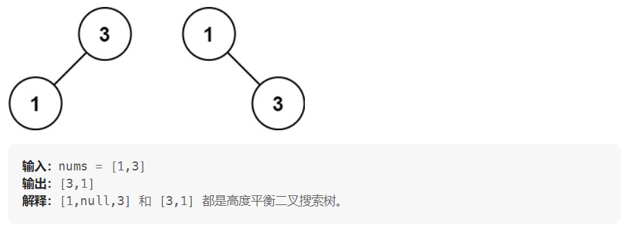

# 108. 将有序数组转换为二叉搜索树

给你一个整数数组 nums ，其中元素已经按 升序 排列，请你将其转换为一棵 高度平衡 二叉搜索树。

高度平衡 二叉树是一棵满足「每个节点的左右两个子树的高度差的绝对值不超过 1 」的二叉树。

**示例 1：**

**示例 2：**

**提示：**

 - 1 <= nums.length <= 10^4
 - -10^4 <= nums[i] <= 10^4
 - nums 按 严格递增 顺序排列

---