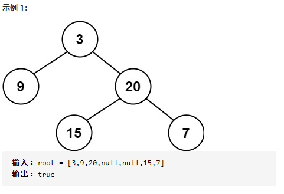
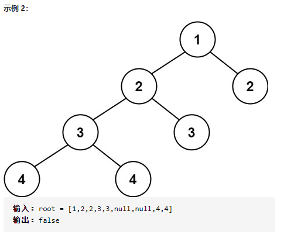

# 110. 平衡二叉树

给定一个二叉树，判断它是否是高度平衡的二叉树。

本题中，一棵高度平衡二叉树定义为：

    一个二叉树每个节点 的左右两个子树的高度差的绝对值不超过 1 。
    

示例 3：

    输入：root = []
    输出：true
 

提示：

    树中的节点数在范围 [0, 5000] 内
    -104 <= Node.val <= 104

